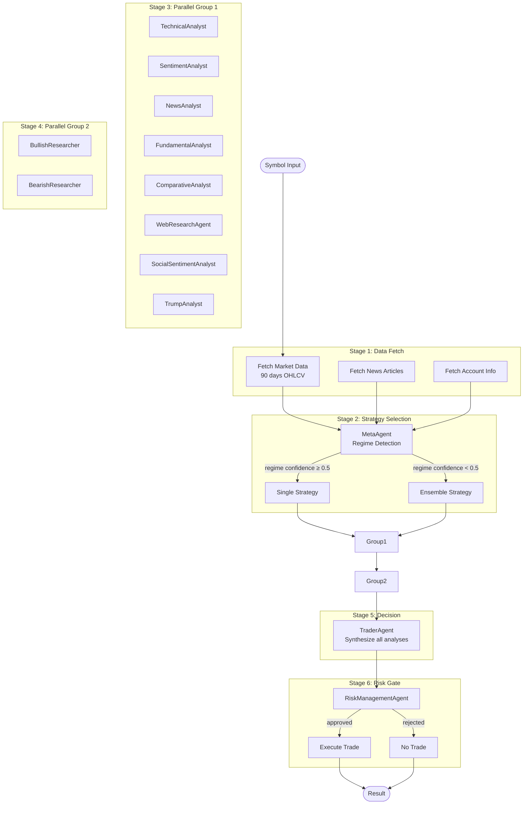
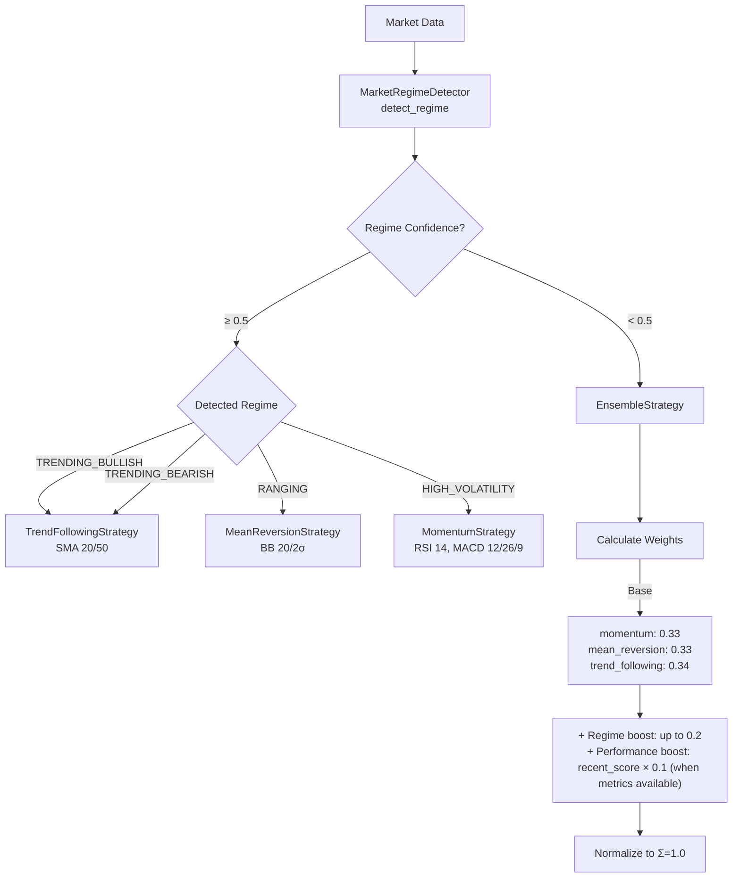
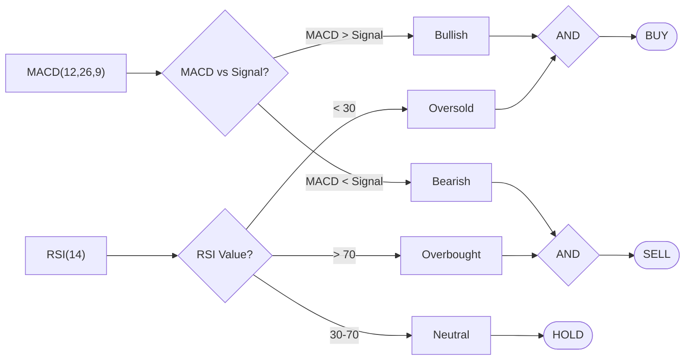
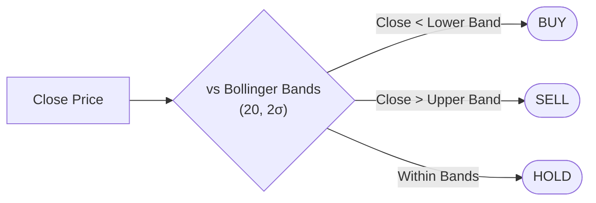
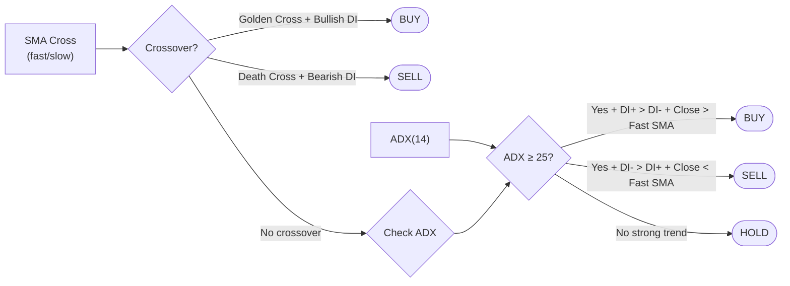
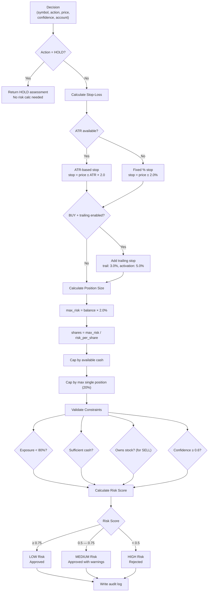

# Analysis Pipeline

Per-symbol analysis flow from raw market data to a BUY/SELL/HOLD decision with risk gating.

## Complete Pipeline



**Stage details:**

| Stage | Async | Agents | Depends On |
|---|---|---|---|
| 1. Data Fetch | Yes | — | Symbol input |
| 2. Strategy Selection | Yes | MetaAgent | Market data |
| 3. Group 1 | Parallel | 7 core (optional Trump when enabled) | Data + strategy |
| 4. Group 2 | Parallel | 2 agents | Group 1 results |
| 5. Decision | Sequential | TraderAgent | All analyses |
| 6. Risk Gate | Sequential | RiskManagementAgent | Decision + account |

## Strategy Selection



**Regime-to-strategy mapping (`STRATEGY_REGIME_MAP`):**

| Regime | Strategy | Key Parameters |
|---|---|---|
| `TRENDING_BULLISH` | TrendFollowing | SMA fast=20, slow=50 |
| `TRENDING_BEARISH` | TrendFollowing | SMA fast=20, slow=50 |
| `RANGING` | MeanReversion | BB period=20, std=2.0 |
| `HIGH_VOLATILITY` | Momentum | RSI 14, MACD 12/26/9 |

**Ensemble weight constants:**

| Constant | Value |
|---|---|
| `LOW_CONFIDENCE_THRESHOLD` | 0.5 |
| `REGIME_WEIGHT_BOOST` | 0.2 |
| `PERFORMANCE_WEIGHT_BOOST` | 0.1 |
| `WIN_RATE_THRESHOLD` | 0.5 |

## Strategy Signal Logic

### Momentum (RSI + MACD)



### Mean Reversion (Bollinger Bands)



### Trend Following (SMA + ADX)



### Ensemble Aggregation

| Method | Logic | Conflict Resolution |
|---|---|---|
| `WEIGHTED_VOTING` | Sum weights per signal, highest wins | If BUY-SELL margin < 10% → HOLD |
| `MAJORITY_VOTE` | 1 vote per strategy, majority wins | If tie → HOLD |
| `UNANIMOUS` | All strategies must agree | Any disagreement → HOLD |

**Ensemble confidence formula:**
```
confidence = (agreement_ratio × 0.4) + (weighted_score × 0.4) + (signal_strength × 0.2)
```

**Default ensemble weights:**

| Strategy | Weight |
|---|---|
| Momentum | 0.40 |
| Mean Reversion | 0.25 |
| Trend Following | 0.35 |

**Conflict margin threshold:** 0.10 (10%)

## Risk Assessment Flow



## Agent Reference

| Agent | Input | Output Model | Core/Optional | Uses LLM |
|---|---|---|---|---|
| TechnicalAnalyst | Market data (OHLCV) | `TechnicalAnalysis` | Core | Yes |
| SentimentAnalyst | News articles | `SentimentAnalysis` | Core | No (FinBERT) |
| NewsAnalyst | News articles | `NewsAnalysis` | Core | Yes |
| FundamentalAnalyst | Symbol | `FundamentalAnalysis` | Optional | Yes |
| ComparativeAnalyst | Symbol + market data | `ComparativeAnalysis` | Optional | Yes |
| WebResearchAgent | Symbol | `WebResearchAnalysis` | Optional | Yes |
| SocialSentimentAnalyst | Symbol | `SocialSentimentAnalysis` | Optional | Yes |
| TrumpAnalyst | Truth Social posts | `TrumpAnalysis` | Optional | Yes |
| BullishResearcher | Group 1 results | `BullishResearchAnalysis` | Core | Yes |
| BearishResearcher | Group 1 results | `BearishResearchAnalysis` | Core | Yes |
| TraderAgent | All analyses | `TradingDecision` | Core | Yes |
| RiskManagementAgent | Decision + account | `RiskAssessment` | Core | No |
| MetaAgent | Market data | `StrategySelection` | Core | No |

## Indicator Thresholds

| Indicator | Parameter | Value | Source |
|---|---|---|---|
| RSI period | `rsi_period` | 14 | `momentum.py` |
| RSI oversold | `rsi_oversold` | 30.0 | `momentum.py` |
| RSI overbought | `rsi_overbought` | 70.0 | `momentum.py` |
| MACD fast | `macd_fast` | 12 | `momentum.py` |
| MACD slow | `macd_slow` | 26 | `momentum.py` |
| MACD signal | `macd_signal` | 9 | `momentum.py` |
| BB period | `bb_period` | 20 | `mean_reversion.py` |
| BB std dev | `bb_std` | 2.0 | `mean_reversion.py` |
| SMA fast | `sma_fast` | 50 (default) / 20 (meta) | `trend_following.py` |
| SMA slow | `sma_slow` | 200 (default) / 50 (meta) | `trend_following.py` |
| ADX period | `adx_period` | 14 | `trend_following.py` |
| ADX threshold | `adx_threshold` | 25.0 | `trend_following.py` |
| ATR period | — | 14 | `risk.py` |
| ATR multiplier | `ATR_MULTIPLIER` | 2.0 | `risk.py` |

## Risk Constants

| Constant | Value | Description |
|---|---|---|
| `MAX_POSITION_RISK_PERCENT` | 2.0% | Max risk per trade |
| `MAX_TOTAL_EXPOSURE_PERCENT` | 80.0% | Max total portfolio exposure |
| `MAX_SINGLE_POSITION_PERCENT` | 20.0% | Max single position size |
| `DEFAULT_STOP_LOSS_PERCENT` | 2.0% | Fallback stop-loss |
| `ATR_MULTIPLIER` | 2.0 | ATR-based stop-loss multiplier |
| `TRAILING_STOP_PERCENT` | 3.0% | Trailing stop distance |
| `TRAILING_ACTIVATION_PERCENT` | 5.0% | Trailing stop activation |
| `MIN_DECISION_CONFIDENCE` | 0.6 | Minimum confidence to approve |
| `RISK_LEVEL_LOW_THRESHOLD` | 0.75 | Risk score for LOW level |
| `RISK_LEVEL_MEDIUM_THRESHOLD` | 0.5 | Risk score for MEDIUM level |
| `REJECTED_CONFIDENCE_PENALTY` | 0.3 | Confidence penalty if rejected |
| `RISK_SCORE_WEIGHT` | 0.6 | Risk score weight in final confidence |
| `DECISION_CONFIDENCE_WEIGHT` | 0.4 | Decision confidence weight |

**Risk score formula:**
```
risk_score = (risk_component × 0.3) + (exposure_component × 0.3) + (confidence × 0.4)
```

---

**See also:** [Daemon Architecture](daemon-architecture.md) | [Daemon Operations](daemon-operations.md)
