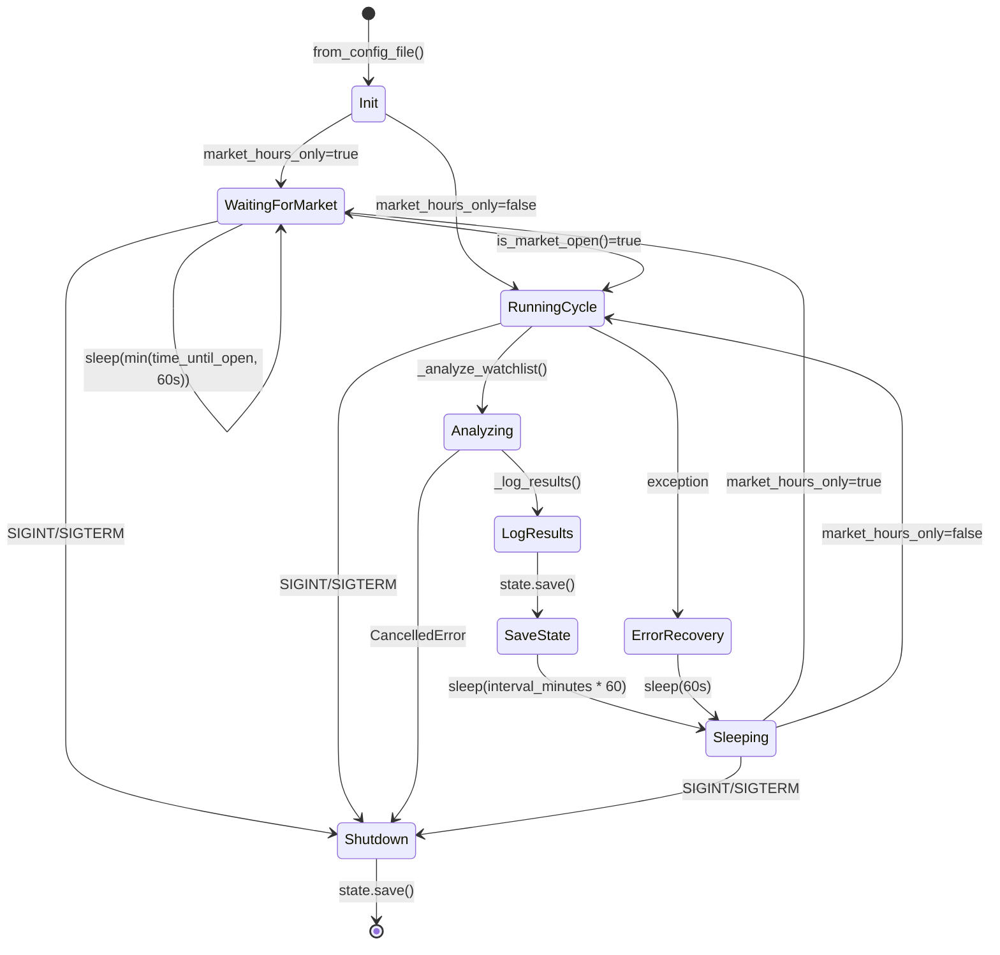
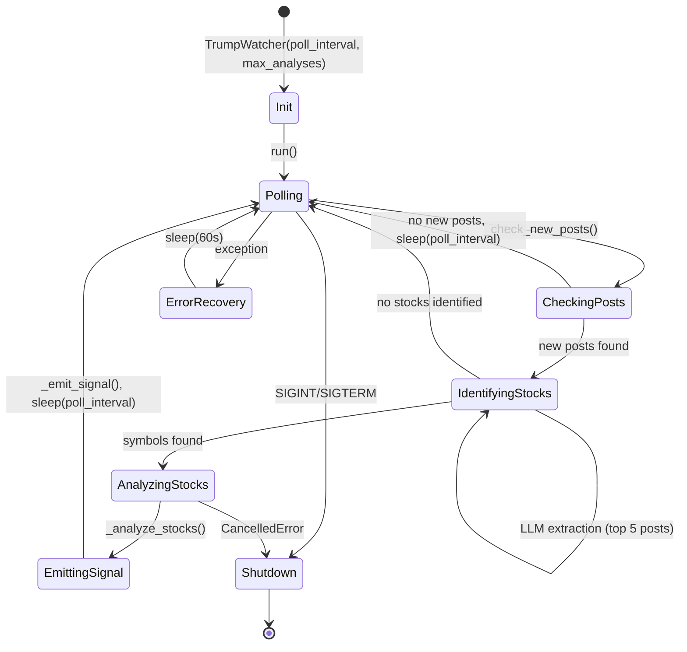
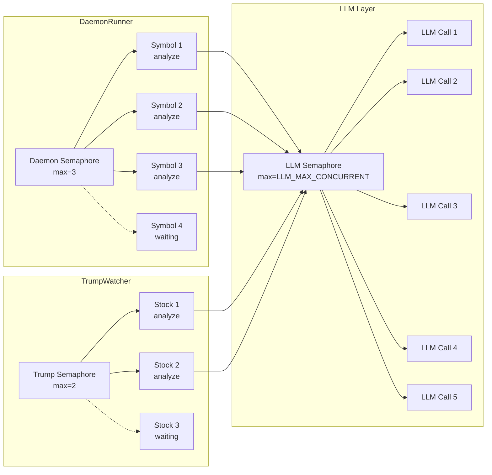

# Daemon Architecture

System-level architecture of the AI Casino daemon mode: component relationships, lifecycles, concurrency, and market session handling.

## Component Dependency Graph

```mermaid
graph TD
    subgraph Daemon Layer
        DR[DaemonRunner]
        TW[TrumpWatcher]
        MS[MarketScheduler]
        DS[DaemonState]
        DC[DaemonConfig]
    end

    subgraph Orchestration
        TradingWorkflow
        MetaAgent
    end

    subgraph Analysis Agents
        TA[TechnicalAnalyst]
        SA[SentimentAnalyst]
        NA[NewsAnalyst]
        FA[FundamentalAnalyst]
        CA[ComparativeAnalyst]
        WR[WebResearchAgent]
        SSA[SocialSentimentAnalyst]
        TRA[TrumpAnalyst]
        BR[BullishResearcher]
        BER[BearishResearcher]
    end

    subgraph Decision & Risk
        Trader[TraderAgent]
        RM[RiskManagementAgent]
    end

    subgraph Execution
        AB[AlpacaBroker]
        MT[MetricsTracker]
        PSR[PortfolioSnapshotRepository]
    end

    DR --> DC
    DR --> MS
    DR --> DS
    DR --> TradingWorkflow

    TW --> TradingWorkflow
    TW --> TRA

    MS --> DC

    TradingWorkflow --> MetaAgent
    TradingWorkflow --> TA
    TradingWorkflow --> SA
    TradingWorkflow --> NA
    TradingWorkflow --> FA
    TradingWorkflow --> CA
    TradingWorkflow --> WR
    TradingWorkflow --> SSA
    TradingWorkflow --> TRA
    TradingWorkflow --> BR
    TradingWorkflow --> BER
    TradingWorkflow --> Trader
    TradingWorkflow --> RM

    RM --> AB
    TradingWorkflow --> MT
    TradingWorkflow --> PSR
```

## DaemonRunner Lifecycle

**Key transitions:**

- **Init**: Loads `DaemonConfig` from TOML, creates `MarketScheduler` and `DaemonState`
- **WaitingForMarket**: Polls `is_market_open()` every `min(time_until_open, 60)` seconds
- **Analyzing**: Runs all watchlist symbols concurrently via `asyncio.Semaphore`
- **Sleeping**: Waits `interval_minutes` (default: 30 min) between cycles
- **Shutdown**: Graceful — saves state, sets `running=False`

## TrumpWatcher Lifecycle

**Key details:**

- **Polling**: Checks Truth Social every `poll_interval` (default: 60s)
- **First run**: Looks back 1 hour for recent posts
- **Stock identification**: Two-pass — keyword matching against `SECTOR_STOCKS` map, then LLM extraction
- **SECTOR_STOCKS sectors**: tariff, china, crypto, oil, bank, tech, defense, pharma (2 stocks per sector match)
- **Analysis cap**: Max `max_analyses` (default: 5) stocks per cycle
- **Content sanitization**: Posts truncated to 200 chars for LLM processing

## Concurrency Model

| Semaphore | Default Limit | Configurable | Source |
|---|---|---|---|
| Daemon concurrent analyses | 3 | `max_concurrent_analyses` in config | `runner.py` |
| Trump concurrent analyses | 2 | No (hardcoded) | `trump_watcher.py` |
| LLM concurrent calls | 5 | `LLM_MAX_CONCURRENT` env var (1-20) | `models/llm.py` |

All semaphores use `asyncio.Semaphore` — no threading, fully async.

## Trading Sessions Timeline

```mermaid
gantt
    title Trading Sessions (Eastern Time)
    dateFormat HH:mm
    axisFormat %H:%M

    section Market Closed
    Overnight           :done, 00:00, 04:00

    section Pre-Market
    Pre-Market (optional) :active, 04:00, 09:30

    section Regular Hours
    Regular Session      :crit, 09:30, 16:00

    section Market Closed
    After Hours          :done, 16:00, 23:59
```

| Session | Hours (ET) | Config Flag | Behavior |
|---|---|---|---|
| Pre-Market | 04:00 — 09:30 | `enable_pre_market: true` | Same pipeline, flagged as `PRE_MARKET` in results |
| Regular | 09:30 — 16:00 | Always enabled | Standard analysis cycle |
| Closed | 16:00 — 04:00 | — | Daemon waits (if `market_hours_only=true`) |

- Weekend handling: Friday close → Monday open (scheduler skips Saturday/Sunday)
- No automatic confidence adjustment between sessions — data quality varies naturally
- Session type recorded in `AnalysisRecord.trading_session` and `TradingWorkflowResult`

---

**See also:** [Analysis Pipeline](analysis-pipeline.md) | [Daemon Operations](daemon-operations.md)
