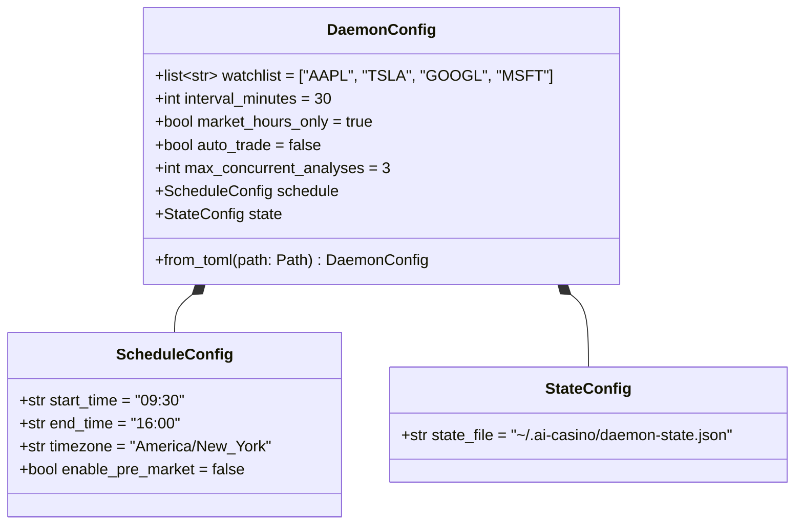
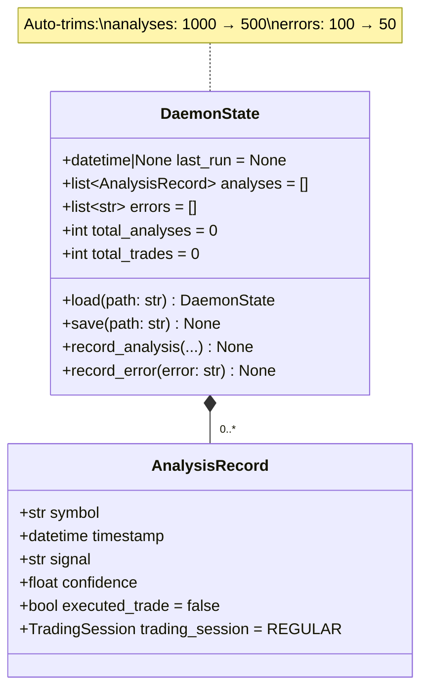
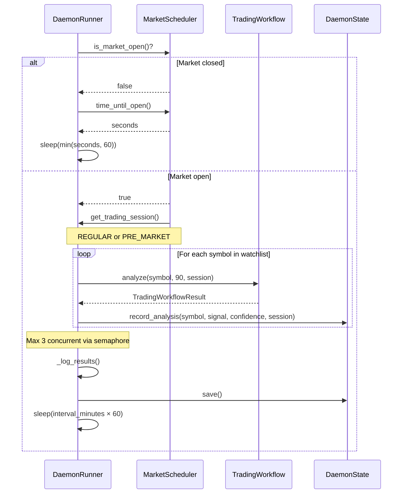

# Daemon Operations

Configuration reference, state management, and operational guide for running the AI Casino daemon.

## Quick Start

```bash
# Start daemon with default config
python -m src.main daemon

# Start with custom config
python -m src.main daemon --config daemon.toml

# Start Trump watcher
python -m src.main trump-daemon --interval 5 --max-analyses 10

# Stop daemon
# Send SIGINT (Ctrl+C) or SIGTERM — graceful shutdown with state save
```

## Configuration

### Config Structure



### Complete TOML Example

```toml
# daemon.toml

[daemon]
watchlist = ["AAPL", "TSLA", "GOOGL", "MSFT", "NVDA"]
interval_minutes = 30
market_hours_only = true
auto_trade = false
max_concurrent_analyses = 3

[daemon.schedule]
start_time = "09:30"
end_time = "16:00"
timezone = "America/New_York"
enable_pre_market = false

[daemon.state]
state_file = "~/.ai-casino/daemon-state.json"
```

### Config Parameters

| Parameter | Type | Default | Description |
|---|---|---|---|
| `watchlist` | `list[str]` | `["AAPL", "TSLA", "GOOGL", "MSFT"]` | Symbols to analyze |
| `interval_minutes` | `int` | `30` | Minutes between analysis cycles |
| `market_hours_only` | `bool` | `true` | Only analyze during market hours |
| `auto_trade` | `bool` | `false` | Execute trades automatically |
| `max_concurrent_analyses` | `int` | `3` | Max parallel symbol analyses |
| `schedule.start_time` | `str` | `"09:30"` | Market open (HH:MM) |
| `schedule.end_time` | `str` | `"16:00"` | Market close (HH:MM) |
| `schedule.timezone` | `str` | `"America/New_York"` | Market timezone |
| `schedule.enable_pre_market` | `bool` | `false` | Enable 04:00-09:30 ET session |
| `state.state_file` | `str` | `"~/.ai-casino/daemon-state.json"` | State persistence path |

### Environment Variables

| Variable | Required | Default | Description |
|---|---|---|---|
| `ALPHA_VANTAGE_API_KEY` | Yes | — | Market data API key |
| `MARKETAUX_API_KEY` | No | — | News data API key |
| `ALPACA_API_KEY` | No | — | Broker API key (for auto_trade) |
| `ALPACA_SECRET_KEY` | No | — | Broker secret key |
| `LLM_PROVIDER` | No | `ollama` | LLM provider (ollama/anthropic/openai) |
| `LLM_MODEL` | No | `qwen3:14b` | LLM model name |
| `LLM_MAX_CONCURRENT` | No | `5` | Max concurrent LLM calls (1-20) |
| `ANTHROPIC_API_KEY` | No | — | Anthropic API key |
| `OPENAI_API_KEY` | No | — | OpenAI API key |
| `LOG_LEVEL` | No | `INFO` | Logging level |
| `OLLAMA_BASE_URL` | No | `http://localhost:11434` | Ollama server URL |
| `ALPACA_BASE_URL` | No | `https://paper-api.alpaca.markets` | Alpaca API base URL |
| `MAX_POSITION_RISK` | No | `2.0` | Max risk per trade (%) |
| `MAX_EXPOSURE` | No | `80.0` | Max total exposure (%) |
| `MAX_SINGLE_POSITION` | No | `20.0` | Max single position (%) |

## State Management

### State Data Model



**Persistence details:**

- **Format**: JSON file at `state.state_file` path
- **Save triggers**: After each analysis cycle, on graceful shutdown
- **Load failure**: Logs warning, starts with fresh state (no crash)
- **Auto-trimming**: Prevents unbounded growth
  - Analyses: Trimmed to 500 most recent when exceeding 1000
  - Errors: Trimmed to 50 most recent when exceeding 100

## DaemonRunner Cycle Sequence



## Error Handling & Monitoring

### Error Recovery

| Error Type | Handler | Recovery |
|---|---|---|
| Single symbol failure | `_analyze_symbol` try/except | Log error, skip symbol, continue cycle |
| Watchlist cycle failure | `_analyze_watchlist` using `asyncio.gather(..., return_exceptions=True)` | Record error in state, continue |
| Daemon loop exception | `run()` try/except | Log exception, sleep 60s, retry |
| `asyncio.CancelledError` | Explicit catch | Graceful shutdown, save state |
| State load failure | `DaemonState.load()` | Warning, fresh state |
| State save failure | `DaemonState.save()` | Log error, continue |

### Monitoring

**Log locations:**

| Log | Path | Level |
|---|---|---|
| Daemon log | stderr (via LOG_LEVEL) | INFO (default) |
| Risk audit log | `logs/risk_audit.jsonl` | — (structured JSONL) |
| Console output | stdout (via Rich) | Configurable via `LOG_LEVEL` |

**Key log patterns to watch:**

```
# Successful cycle
INFO | DaemonRunner | Completed analysis cycle for 4 symbols

# Market hours wait
INFO | MarketScheduler | Market closed, waiting X seconds

# Symbol failure (non-fatal)
ERROR | DaemonRunner | Failed to analyze AAPL: <error>

# State trimming
DEBUG | DaemonState | Trimmed analyses from 1000 to 500

# Graceful shutdown
INFO | DaemonRunner | Shutting down, saving state...
```

### TrumpWatcher Specifics

| Parameter | Default | Description |
|---|---|---|
| `poll_interval` | 60s | Seconds between Truth Social checks |
| `max_analyses` | 5 | Max stocks analyzed per post batch |
| First run lookback | 1 hour | How far back to check on startup |
| Content truncation | 200 chars | Max post length sent to LLM |
| Analysis period | 30 days | Market data lookback for analysis |
| Concurrent analyses | 2 | Hardcoded semaphore limit |

**Sector-stock mapping** (`SECTOR_STOCKS`): tariff, china, crypto, oil, bank, tech, defense, pharma — each mapped to a small list of tickers, with the top 2 selected per keyword match.

---

**See also:** [Daemon Architecture](daemon-architecture.md) | [Analysis Pipeline](analysis-pipeline.md)
