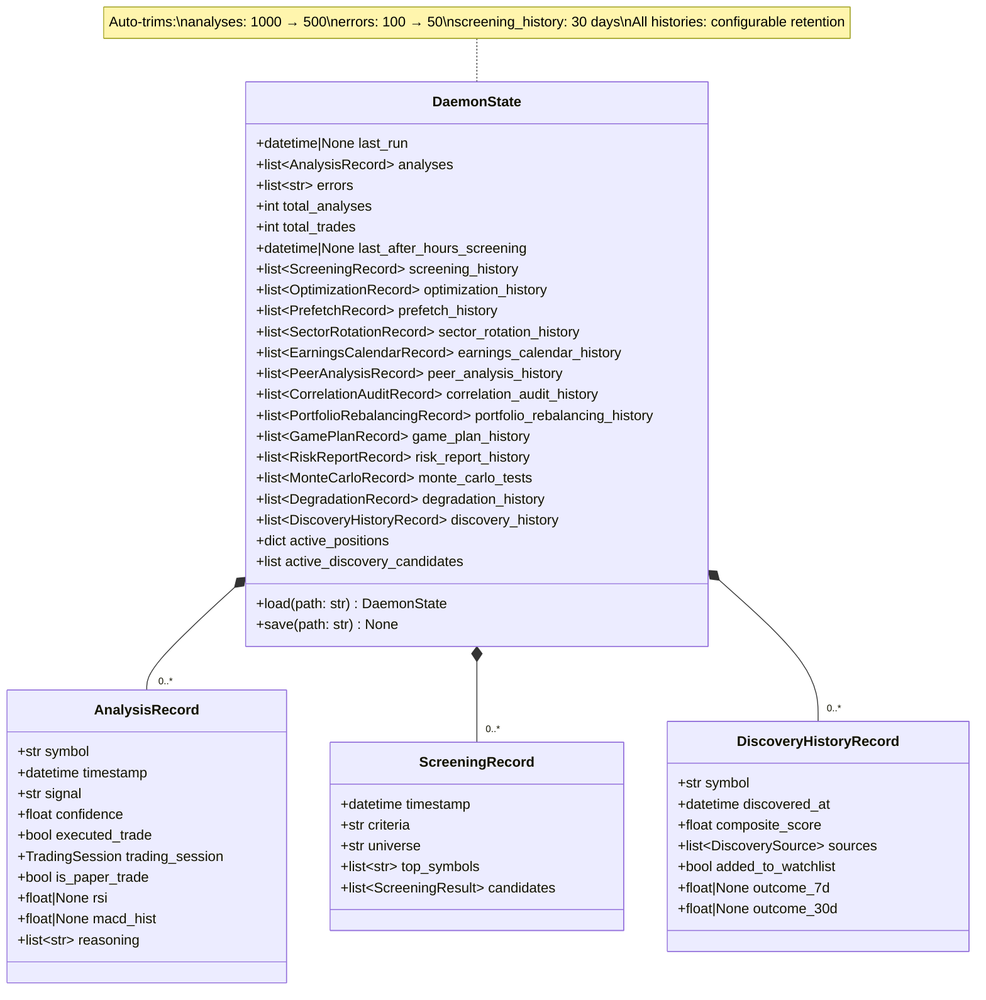
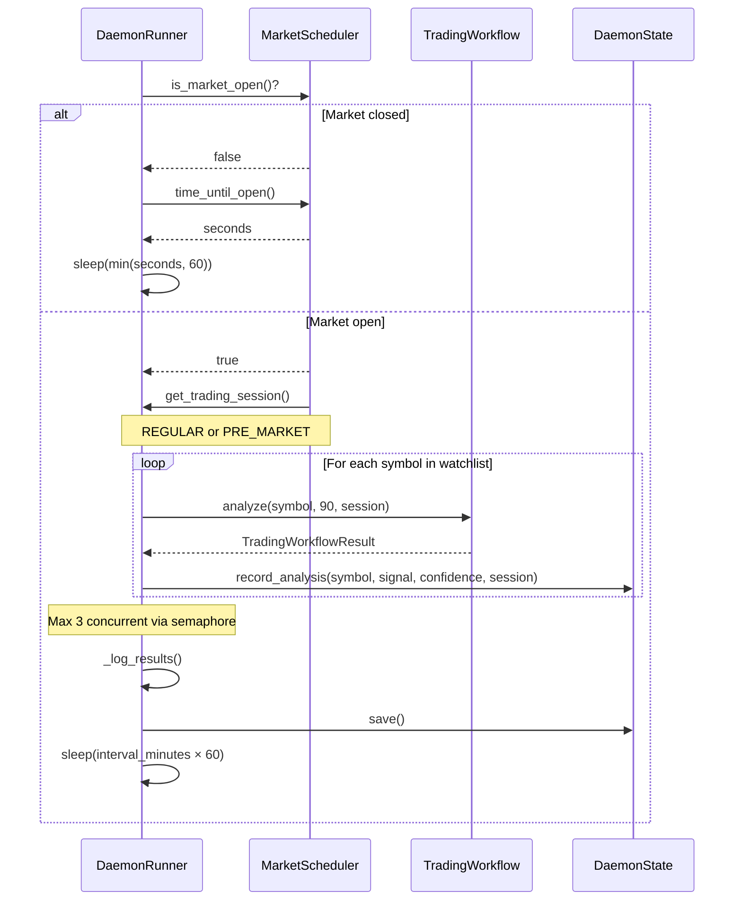

# Daemon Operations

Configuration reference, state management, and operational guide for running the AI Casino daemon.

## Quick Start

```bash
# Start daemon with default config
python -m src.main daemon

# Start with custom config
python -m src.main daemon --config daemon.yaml

# Start Trump watcher
python -m src.main trump-daemon --interval 5 --max-analyses 10

# Stop daemon
# Send SIGINT (Ctrl+C) or SIGTERM — graceful shutdown with state save
```

## Configuration

### Config Structure

```mermaid
classDiagram
    class DaemonConfig {
        +list~str~ watchlist
        +int interval_minutes = 30
        +bool market_hours_only = true
        +bool auto_trade = false
        +int max_concurrent_analyses = 3
        +TradingMode trading_mode = PAPER
        +from_yaml(path: Path) DaemonConfig
    }

    class TradingConfigs {
        <<group>>
        +ScheduleConfig schedule
        +StateConfig state
        +PaperTradingConfig paper_trading
        +JournalConfig journal
        +OptimizationConfig optimization
    }

    class AnalysisConfigs {
        <<group>>
        +AnalysisOrchestratorConfig analysis_orchestration
        +NewsWatcherConfig news_watcher
        +SocialWatcherConfig social_watcher
        +FilingsWatcherConfig filings_watcher
        +AnomalyWatcherConfig anomaly_watcher
    }

    class RiskConfigs {
        <<group>>
        +RiskLimitsConfig risk_limits
        +PositionSizingConfig position_sizing
        +PositionManagementConfig position_management
        +MonteCarloConfig monte_carlo
        +PreTradeBacktestingConfig pre_trade_backtesting
    }

    class PortfolioConfigs {
        <<group>>
        +PortfolioRebalancingConfig rebalancing
        +PeerAnalysisConfig peer_analysis
        +CorrelationAuditConfig correlation_audit
        +GamePlanConfig game_plan
    }

    class ScreeningConfigs {
        <<group>>
        +ScreeningConfig screening
        +DiscoveryConfig discovery
        +LiquidityFilterConfig liquidity_filters
        +SectorRotationConfig sector_rotation
        +EarningsCalendarConfig earnings_calendar
    }

    class InfraConfigs {
        <<group>>
        +ApiConfig api
        +LLMConfig llm
        +ApiKeysConfig api_keys
        +DataSourcesConfig data_sources
        +DatabaseConfig database
        +PrefetchConfig prefetch
    }

    class ReportingConfigs {
        <<group>>
        +ReportingConfig reporting
        +SignalTrackingConfig signal_tracking
        +HealthConfig health
        +NotificationsConfig notifications
    }

    DaemonConfig *-- TradingConfigs
    DaemonConfig *-- AnalysisConfigs
    DaemonConfig *-- RiskConfigs
    DaemonConfig *-- PortfolioConfigs
    DaemonConfig *-- ScreeningConfigs
    DaemonConfig *-- InfraConfigs
    DaemonConfig *-- ReportingConfigs
```



**Config groups:**

| Group | Configs | Purpose |
|---|---|---|
| **Trading** | schedule, state, paper_trading, journal, optimization | Core trading operations |
| **Analysis** | analysis_orchestration, news/social/filings/anomaly watchers | Event-driven analysis |
| **Risk** | risk_limits, position_sizing, position_management, monte_carlo, pre_trade_backtesting | Risk management |
| **Portfolio** | rebalancing, peer_analysis, correlation_audit, game_plan | Portfolio optimization |
| **Screening** | screening, discovery, liquidity_filters, sector_rotation, earnings_calendar | Stock discovery |
| **Infrastructure** | api, llm, api_keys, data_sources, database, prefetch | External integrations |
| **Reporting** | reporting, signal_tracking, health, notifications | Monitoring & alerts |

### Complete YAML Example

```yaml
# daemon.yaml

daemon:
  watchlist: ["AAPL", "TSLA", "GOOGL", "MSFT", "NVDA"]
  interval_minutes: 30
  market_hours_only: true
  auto_trade: false
  max_concurrent_analyses: 3

  schedule:
    start_time: "09:30"
    end_time: "16:00"
    timezone: "America/New_York"
    enable_pre_market: false

  screening:
    enabled: true
    screen_time: "16:30"
    screen_days: ["mon", "tue", "wed", "thu", "fri"]
    criteria: "momentum"        # momentum, value, breakout
    universe: "COMBINED"        # SP500, NASDAQ100, COMBINED
    top_n: 10
    watchlist_name: "daemon-screening"

  state:
    state_file: "~/.ai-casino/daemon-state.json"
```

### Config Parameters

| Parameter | Type | Default | Description |
|---|---|---|---|
| `watchlist` | `list[str]` | `["AAPL", "TSLA", "GOOGL", "MSFT"]` | Symbols to analyze |
| `interval_minutes` | `int` | `30` | Minutes between analysis cycles |
| `market_hours_only` | `bool` | `true` | Only analyze during market hours |
| `auto_trade` | `bool` | `false` | Execute trades automatically |
| `max_concurrent_analyses` | `int` | `3` | Max parallel symbol analyses |
| `schedule.start_time` | `str` | `"09:30"` | Market open (HH:MM) |
| `schedule.end_time` | `str` | `"16:00"` | Market close (HH:MM) |
| `schedule.timezone` | `str` | `"America/New_York"` | Market timezone |
| `schedule.enable_pre_market` | `bool` | `false` | Enable 04:00-09:30 ET session |
| `schedule.enable_after_hours` | `bool` | `false` | Enable after-hours trading session (16:00-20:00 ET) |
| `screening.enabled` | `bool` | `false` | Enable after-hours watchlist screening |
| `screening.screen_time` | `str` | `"16:30"` | Time to run screening (HH:MM, 16:00-20:00) |
| `screening.screen_days` | `list[str]` | `["mon", "tue", "wed", "thu", "fri"]` | Days to run screening |
| `screening.criteria` | `str` | `"momentum"` | Screening criteria (momentum/value/breakout) |
| `screening.universe` | `str` | `"COMBINED"` | Stock universe (SP500/NASDAQ100/COMBINED) |
| `screening.top_n` | `int` | `10` | Number of top candidates to track |
| `screening.watchlist_name` | `str` | `"daemon-screening"` | Watchlist file name for exports |
| `state.state_file` | `str` | `"~/.ai-casino/daemon-state.json"` | State persistence path |

### Configuration

All daemon configuration is YAML-based. See `docs/daemon.yaml.example` for comprehensive documentation.

**Key configuration sections:**

| Section           | Purpose                                   |
|:------------------|:------------------------------------------|
| `llm`             | LLM provider, model, concurrency settings |
| `api_keys`        | API keys for data providers and brokers   |
| `logging`         | Log level configuration                   |
| `metrics`         | Performance metrics and risk-free rate    |
| `ui`              | Dashboard and TUI theme settings          |
| `database`        | PostgreSQL persistence configuration      |
| `position_sizing` | Risk management limits                    |
| `notifications`   | Telegram notification settings            |

See [Configuration Guide](../README.md#configuration) for setup instructions.

### After-Hours Screening

After-hours screening runs daily (when enabled) to discover new watchlist candidates. Screens full universe (~600 stocks) using momentum/value/breakout criteria.

**Schedule:**
- Runs between 16:00-20:00 ET (after regular market close)
- Configurable time and days (default: 16:30 weekdays)
- Deduplication prevents multiple runs per day

**Criteria:**
- **Momentum**: RSI < 40 + MACD bullish + price > 50-day MA
- **Value**: Low P/E + P/B < 3 + positive momentum
- **Breakout**: Within 5% of 52-week high + volume > 1.5x avg

**Universe:**
- **SP500**: ~500 stocks from S&P 500
- **NASDAQ100**: ~100 stocks from NASDAQ 100
- **COMBINED**: ~600 stocks (default)

**Viewing Results:**

```bash
# View latest candidates in TUI
/candidates

# Add candidates to watchlist
/candidates add NVDA AMD TSLA

# Clear old screening records
/candidates clear

# View state file directly
cat ~/.ai-casino/daemon-state.json | jq .screening_history
```

**Example Output:**

```
After-Hours Screening (16:30)
──────────────────────────────
Momentum Screening
Universe: COMBINED, Screened: 603

1. NVDA (NVIDIA Corporation) - Score: 0.82
   RSI 38.2 (oversold), MACD bullish (0.0234), volume 3.2x avg

2. AMD (Advanced Micro Devices) - Score: 0.76
   RSI 35.1 (oversold), MACD bullish (0.0189), earnings in 2 days

[Full results in daemon state]
```

## State Management

### State Data Model



**Persistence details:**

- **Format**: JSON file at `state.state_file` path
- **Save triggers**: After each analysis cycle, on graceful shutdown
- **Load failure**: Logs warning, starts with fresh state (no crash)
- **Auto-trimming**: Prevents unbounded growth
  - Analyses: Trimmed to 500 most recent when exceeding 1000
  - Errors: Trimmed to 50 most recent when exceeding 100

## DaemonRunner Cycle Sequence



## Error Handling & Monitoring

### Error Recovery

| Error Type | Handler | Recovery |
|---|---|---|
| Single symbol failure | `_analyze_symbol` try/except | Log error, skip symbol, continue cycle |
| Watchlist cycle failure | `_analyze_watchlist` using `asyncio.gather(..., return_exceptions=True)` | Record error in state, continue |
| Daemon loop exception | `run()` try/except | Log exception, sleep 60s, retry |
| `asyncio.CancelledError` | Explicit catch | Graceful shutdown, save state |
| State load failure | `DaemonState.load()` | Warning, fresh state |
| State save failure | `DaemonState.save()` | Log error, continue |

### Monitoring

**Log locations:**

| Log | Path | Level |
|---|---|---|
| Daemon log | stderr (via LOG_LEVEL) | INFO (default) |
| Risk audit log | `logs/risk_audit.jsonl` | — (structured JSONL) |
| Console output | stdout (via Rich) | Configurable via `LOG_LEVEL` |

**Key log patterns to watch:**

```
# Successful cycle
INFO | DaemonRunner | Completed analysis cycle for 4 symbols

# Market hours wait
INFO | MarketScheduler | Market closed, waiting X seconds

# Symbol failure (non-fatal)
ERROR | DaemonRunner | Failed to analyze AAPL: <error>

# State trimming
DEBUG | DaemonState | Trimmed analyses from 1000 to 500

# Graceful shutdown
INFO | DaemonRunner | Shutting down, saving state...
```

### TrumpWatcher Specifics

| Parameter | Default | Description |
|---|---|---|
| `poll_interval` | 60s | Seconds between Truth Social checks |
| `max_analyses` | 5 | Max stocks analyzed per post batch |
| First run lookback | 1 hour | How far back to check on startup |
| Content truncation | 200 chars | Max post length sent to LLM |
| Analysis period | 30 days | Market data lookback for analysis |
| Concurrent analyses | 2 | Hardcoded semaphore limit |

**Sector-stock mapping** (`SECTOR_STOCKS`): tariff, china, crypto, oil, bank, tech, defense, pharma — each mapped to a small list of tickers, with the top 2 selected per keyword match.

---

**See also:** [Daemon Architecture](daemon-architecture.md) | [Analysis Pipeline](analysis-pipeline.md)
